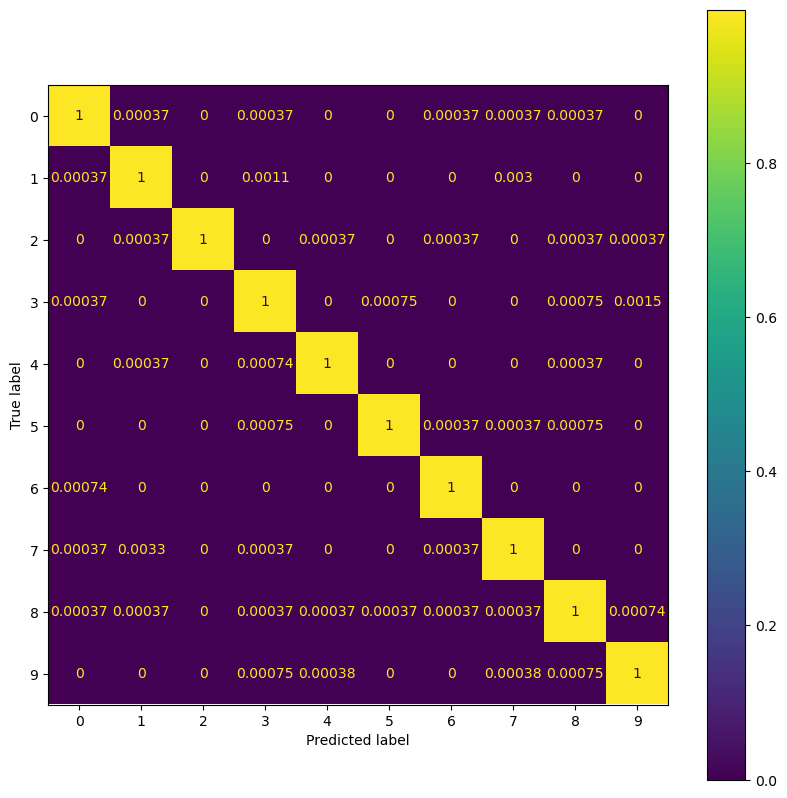

# TMNIST-Classifier
A convolutional deep learning model that can predict the number displayed by a TMNIST image.

# Results:

## Confusion Matrix:

## TSNE Clustering:

## Average loss over 25 epochs:

